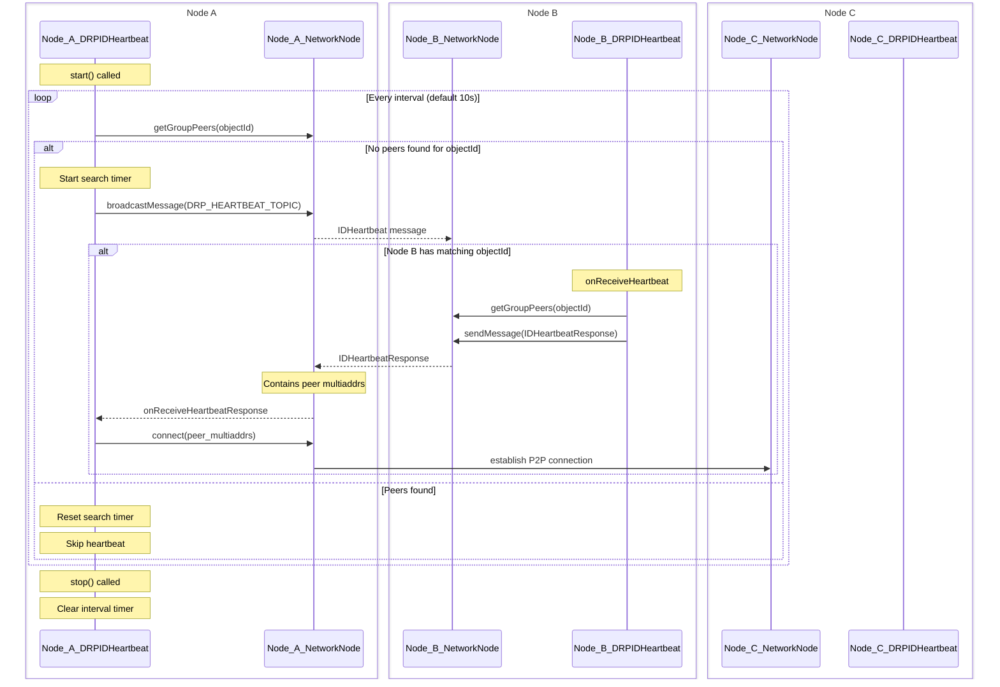

# DRP Heartbeat

The DRP Heartbeat system is a crucial component of the Distributed Resource Protocol (DRP) that enables peer discovery and connection maintenance between nodes sharing the same object IDs.

## Overview

The heartbeat mechanism ensures that nodes with shared object IDs can:
- Discover each other on the network
- Maintain connections with peers
- Handle peer disconnections and reconnections gracefully

## Architecture

The heartbeat system consists of two main components:
- `DRPIDHeartbeat`: Manages the heartbeat process for a specific object ID
- `NetworkNode`: Handles P2P communication between nodes

### Sequence Diagram

The following sequence diagram illustrates the heartbeat process:



## Configuration

The heartbeat system can be configured with the following options:

```typescript
interface DRPIDHeartbeatConfig {
    /** Unique identifier for the object */
    readonly id: string;
    /** Network node instance used for peer communication */
    readonly network_node: DRPNetworkNode;
    /** Interval in milliseconds between heartbeats. Defaults to 10,000ms */
    readonly interval?: number;
    /** Logger configuration options */
    readonly log_config?: LoggerOptions;
    /** Duration in milliseconds to search for peers before giving up. Defaults to 5 minutes */
    readonly search_duration?: number;
}
```

## Key Features

1. **Periodic Heartbeat Checks**
   - Default interval: 10 seconds
   - Configurable through `interval` option

2. **Peer Discovery**
   - Broadcasts heartbeat messages when no peers are found
   - Uses `DRP_HEARTBEAT_TOPIC` for discovery messages
   - Includes object ID for targeted peer matching

3. **Connection Management**
   - Automatically connects to discovered peers
   - Maintains connections with active peers
   - Handles peer multiaddress information

4. **Search Duration**
   - Default duration: 5 minutes
   - Configurable through `search_duration` option
   - Prevents indefinite searching for unavailable peers

## Usage

```typescript
import { DRPIDHeartbeat } from "@ts-drp/node";

// Create a new heartbeat instance
const heartbeat = new DRPIDHeartbeat({
    id: "unique-object-id",
    network_node: networkNode,
    interval: 10000,  // 10 seconds
    search_duration: 300000  // 5 minutes
});

// Start the heartbeat
heartbeat.start();

// Stop the heartbeat when done
heartbeat.stop();
```

## Message Types

The heartbeat system uses two main message types:

1. **IDHeartbeat**
   - Broadcast to discover peers
   - Contains the object ID being searched for

2. **IDHeartbeatResponse**
   - Sent in response to heartbeat messages
   - Contains peer multiaddresses for connection establishment

## Error Handling

The heartbeat system includes:
- Logging of failed peer discoveries
- Automatic retry mechanism within search duration
